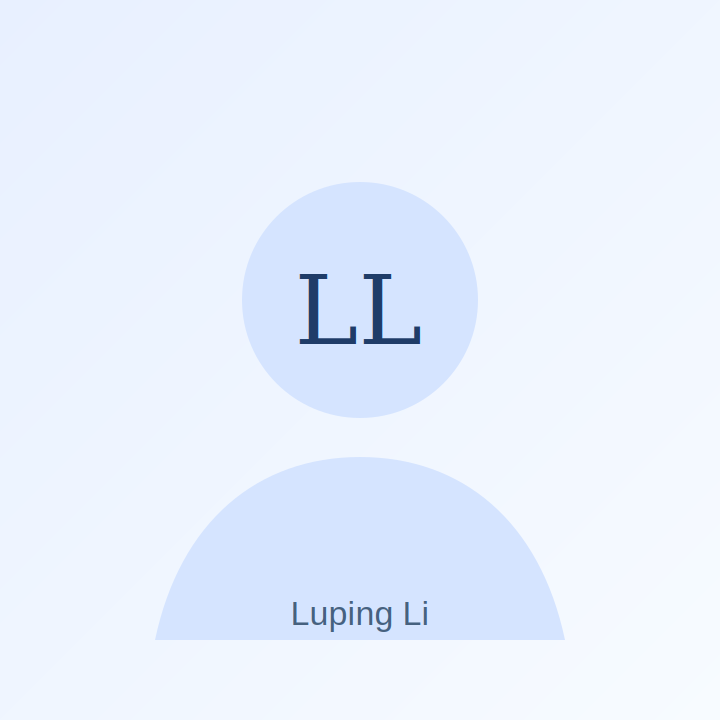

# 李璐平个人学术主页部署说明

这是一个静态个人学术主页，不需要服务器后台和数据库。文件结构如下：

- `index.html`：网页主体
- `styles.css`：样式
- `script.js`：中英文切换与移动端菜单
- `assets/avatar.svg`：默认头像占位图，可替换为个人照片
- `assets/Luping_Li_CV.pdf`：简历 PDF

## 本地预览

双击 `index.html` 即可打开；也可以把整个文件夹拖进 VS Code，用 Live Server 预览。

## 替换个人照片

把你的照片命名为 `profile.jpg` 放入 `assets` 文件夹，然后将 `index.html` 中：

```html

```

改成：

```html

```

## 部署到 GitHub Pages

1. 新建一个 GitHub 仓库，例如 `luping-li.github.io`。
2. 上传本文件夹中的所有文件。
3. 在仓库 Settings → Pages 中选择 `Deploy from a branch`，分支选择 `main`，目录选择 `/root`。
4. 保存后等待部署完成。

## 绑定自己的域名

在 GitHub Pages 设置里添加自定义域名，然后到域名服务商后台添加 DNS 解析。若使用 Vercel，也可直接导入这个文件夹/仓库并绑定域名。

## 隐私提醒

当前网页正文默认不展示手机号、出生年月、政治面貌等隐私字段。简历 PDF 是原始上传文件，若公开部署，建议换成删除隐私信息后的公开版 CV。


## 本版本说明

- 已从简历 PDF 中提取证件照，并处理为 `assets/profile-photo-clear.jpg`。
- 首页已经直接调用该照片，不再使用占位头像。
- 原始提取图保留为 `assets/profile-photo-original.png`，便于后续替换或对比。
- 如果需要部署到公网，建议将 `assets/Luping_Li_CV.pdf` 替换为不含手机号、出生年月、政治面貌等隐私信息的公开版简历。
